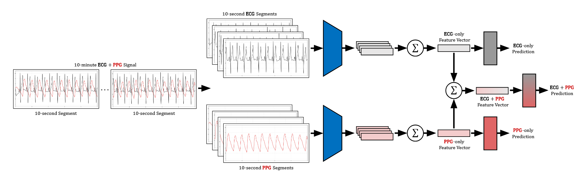

# SignalMC-MED




Official implementation of the paper: \
**SignalMC-MED: A Multimodal Benchmark for Evaluating Biosignal Foundation Models on Single-Lead ECG and PPG**, 2026 [[arXiv]](https://arxiv.org/abs/2603.09940) [[project (TODO!)]](https://github.com/fregu856/SignalMC-MED). \
[Fredrik K. Gustafsson](http://www.fregu856.com/), [Xiao Gu](https://scholar.google.com/citations?user=xpXBs0gAAAAJ&hl=en), [Mattia Carletti](https://scholar.google.com/citations?user=G8UFCW4AAAAJ&hl=en), [Patitapaban Palo](https://scholar.google.com/citations?user=DGIp0NwAAAAJ&hl=en), [David W. Eyre](https://scholar.google.com/citations?user=mSEZ9CEAAAAJ&hl=en), [David A. Clifton](https://scholar.google.com/citations?user=mFN2KJ4AAAAJ&hl=en). \
_TODO!_

If you find this work useful, please consider citing:
```
TODO!
```


***
***

More detailed info will be added to this readme later...

TODO!
