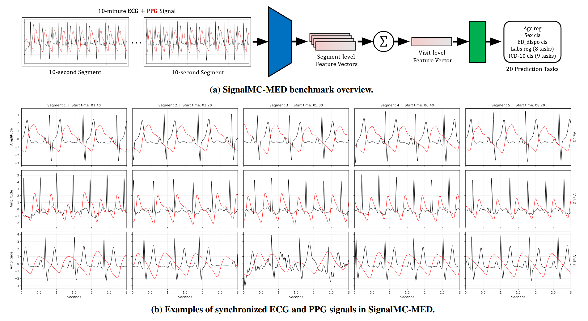

# SignalMC-MED



Official implementation of the paper: \
**SignalMC-MED: A Multimodal Benchmark for Evaluating Biosignal Foundation Models on Single-Lead ECG and PPG**, 2026 [[arXiv]](https://arxiv.org/abs/2603.09940) [[project (TODO!)]](https://github.com/fregu856/SignalMC-MED). \
[Fredrik K. Gustafsson](http://www.fregu856.com/), [Xiao Gu](https://scholar.google.com/citations?user=xpXBs0gAAAAJ&hl=en), [Mattia Carletti](https://scholar.google.com/citations?user=G8UFCW4AAAAJ&hl=en), [Patitapaban Palo](https://scholar.google.com/citations?user=DGIp0NwAAAAJ&hl=en), [David W. Eyre](https://scholar.google.com/citations?user=mSEZ9CEAAAAJ&hl=en), [David A. Clifton](https://scholar.google.com/citations?user=mFN2KJ4AAAAJ&hl=en). \
_Biosignal foundation models (FMs) have shown promise for clinical prediction, yet systematic evaluation on long-duration multimodal data remains limited. We introduce SignalMC-MED, a benchmark of 22,256 emergency department visits with synchronized 10-minute single-lead ECG and PPG, evaluating FMs across 20 clinically relevant tasks. Using this benchmark, we compare representative time-series and biosignal FMs across ECG-only, PPG-only, and ECG + PPG settings. Domain-specific biosignal FMs outperform general time-series models, multimodal ECG + PPG fusion and longer signal segments consistently improve performance, larger model variants do not reliably outperform smaller ones, and hand-crafted ECG domain features remain strong complementary baselines._

If you find this work useful, please consider citing:
```
TODO!
```

Please also cite the original MC-MED dataset:
```
@article{kansal2025mc,
  title={{MC-MED}, multimodal clinical monitoring in the emergency department},
  author={Kansal, Aman and Chen, Emma and Jin, Boyang Tom and Rajpurkar, Pranav and Kim, David A},
  journal={Scientific Data},
  volume={12},
  number={1},
  pages={1094},
  year={2025},
  publisher={Nature Publishing Group UK London}
}

@article{PhysioNet-mc-med-1.0.1,
  author = {Kansal, Aman and Chen, Emma and Jin, Tom and Rajpurkar, Pranav and Kim, David},
  title = {{Multimodal Clinical Monitoring in the Emergency Department (MC-MED)}},
  journal = {{PhysioNet}},
  year = {2025},
  month = sep,
  note = {Version 1.0.1},
  doi = {10.13026/wvyw-g663},
  url = {https://doi.org/10.13026/wvyw-g663}
}
```


***
***

More detailed info will be added to this readme later...

TODO!
